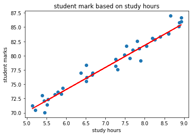
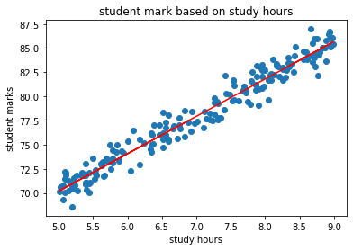

# Exploratory Analysis with Linear Regressions

PR: https://github.com/moayadalhaj/linear-regression/pull/1

## Problem domain

Used linear regression to predict the student mark based on study hours.

The score of fit model was 96.04%

The R/2 metrics was 0.958 which is good.

## The regression model

The model regression compare with all data

